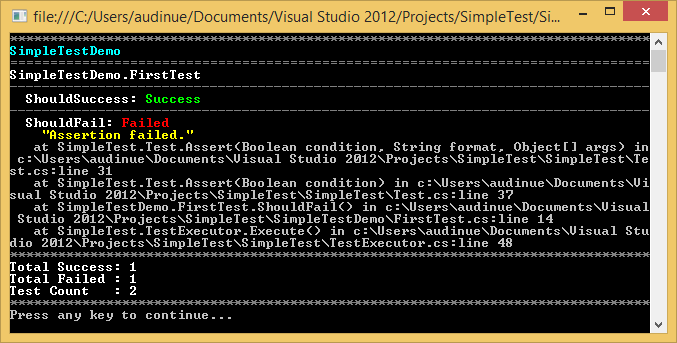

# SimpleTest

1. Create a new console application.
2. Add reference to [SimpleTest](https://github.com/audinue/SimpleTest/releases).
3. Create your first test class.

```csharp
using SimpleTest;

public class FirstTest : Test {
  public void ShouldSuccess() {
    Assert(true);
  }
  public void ShouldFail() {
    Assert(false);
  }
}
```

4. Modify your `Program.cs`

```csharp
using SimpleTest; // Add this...

namespace SimpleTestDemo {
  class Program {
    static void Main(string[] args) {
      Application.RunPaused(); // ...and this
    }
  }
}
```

5. Run your awesome application and you should see something like this:



Notes:

- Two static methods are available in `Application` class: `Run()` and `RunPaused()`.
- SimpleTest executes any **public** methods with zero parameters of your **public** `Test` classes.
- The following methods are available for those classes: `Assert(bool condition, string format, params object[] args)`, `Assert(bool condition)` and `AssertEqual<T>(T a, T b)`.
- You can also override `OnInitialize()`, `OnFinalize()`, `OnBeforeExecute(string methodName)` or `OnBeforeExecute(string methodName)`.
- You can create your very own test viewer from the result of `TestExecutor::Execute()`.

Enjoy!
